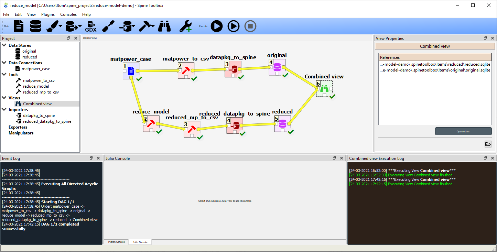
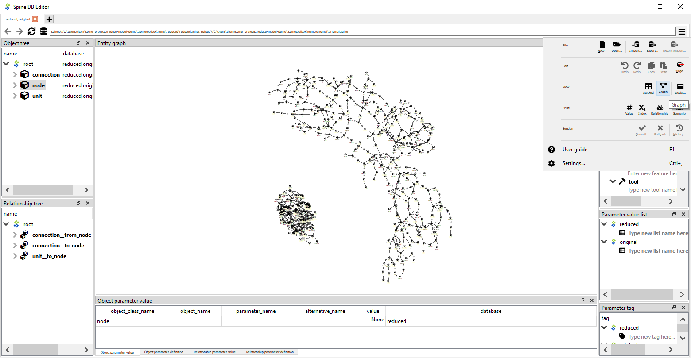

Spine Toolbox ReduceModel.jl demo
=================================

This spine project "reduce-model-demo" demonstrates model reduction.

Requirements
------------

* Spine Toolbox v0.5.36 or later (see https://github.com/Spine-project/Spine-Toolbox)
* Julia 1.4 or later (see https://julialang.org/)

Getting started
---------------

1\. Download or clone the files to your computer, e.g.:

    > git clone https://github.com/Spine-project/reduce-model-demo.git

   (The recommended folder is the folder you store your spine projects in.)

2\. Change the current directory to spine project "reduce-model-demo":

    > cd reduce-model-demo
	
3\. Install required Python packages:
	
	> python -m pip install -r requirements.txt

4\. Install required Julia packages:

    > julia init.jl
    
5\. Open Spine Toolbox, which opens a Graphical User Interface (GUI):

    > python -m spinetoolbox

6\. Open project "reduce-model-demo": 

   `File --> Open Project... --> reduce-model-demo`

7a\. In Toolbox Settings, set Julia executable by selecting "Use Julia executable" radio button:

   `File --> Settings --> Tools --> Use Julia executable` 
   
   (In the first textbox below the radio button is the path to the Julia executable, which should be added automatically)

7b\. In the second textbox below the radio button, set the Julia environment (aka Julia home project) to spine project "reduce-model-demo".

   `Set the lower textbox "Using Julia home project" to <path to project reduce-model-demo>`
   
8\. Click "Execute project" button in the GUI. A successful execution should result in something like below:

   

9\. Open the Spine database "Combined view":	
   - From the dock widget "Project" (on the left hand side) right click on Combined view.
   - From the dock widget "View Properties" (on the right hand side) right click "Open editor".
   - A Spine DB Editor window should now open.
   
10\. Compare graphically the original and reduced model in the Spine DB Editor:	
   - In the Object tree window, right click on node
   - Click on the menu icon in the top right corner of Spine DB Editor, which will open a sub-menu
   - From the sub-menu, select Graphical
   - This should result in a view like below:

   

   
